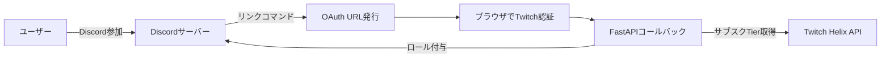

# Twitchサブスク連携Discord Bot

  
  
  

Twitchのサブスク状況を自動判定し、Discordロールの付与/剥奪を行うBotです。  
OAuth認証によってユーザーのTwitchアカウントとDiscordアカウントをリンクし、サブスクTierに応じたロールを自動的に割り当てます。

---

## 機能概要

- **Twitch連携**  
  - Twitch OAuth2 によるアカウントリンク  
  - Helix API を用いたサブスク Tier の取得  

- **Discord連携**  
  - Botによるロール付与/剥奪  
  - サーバー参加時に自動ロールチェック  

- **管理用Web機能 (FastAPI)**  
  - OAuthコールバック処理  
  - リンク状態の確認エンドポイント  

- **インフラ構成**  
  - Windows Server上で常時稼働  
  - Nginxによるリバースプロキシ  
  - Let’s Encrypt (win-acme) によるSSL化  

---

## 技術スタック

- **言語:** Python 3.12  
- **主要ライブラリ:**  
  - py-cord 2.6.1 - Discord Bot用ライブラリ  
  - twitchAPI 4.5.0 - Twitch Helix APIクライアント  
  - FastAPI - OAuthコールバック用APIサーバー  
- **API:** Twitch Helix API / Discord API  
- **インフラ:** Windows Server, Nginx, win-acme  

---

## 動作イメージ



---

## セットアップ手順（ローカル開発環境）

1. **リポジトリをクローン**
```bash
git clone https://github.com/NAKANORyunosuke/NeiBot.git
cd NeiBot
```

2. **仮想環境作成**
```bash
python -m venv venv
venv\Scripts\activate
```

3. **依存パッケージのインストール**
```bash
pip install -r requirements.txt
```

4. **認証情報を設定**  
   `venv/token.json` に以下を保存
```json
{
  "discord_token": "YOUR_DISCORD_BOT_TOKEN",
  "twitch_client_id": "YOUR_TWITCH_CLIENT_ID",
  "twitch_secret_key": "YOUR_TWITCH_SECRET_KEY",
  "twitch_redirect_uri": "https://your.domain.com/twitch/callback"
}
```

5. **Bot & APIサーバー起動**
```bash
python bot/bot_client.py
```

---

## 本番環境構築（Windows Server + Nginx + win-acme）

### 1. Python環境の準備
```powershell
winget install Python.Python.3.12
python -m venv venv
venv\Scripts\activate
pip install -r requirements.txt
```

### 2. Nginxのインストール
```powershell
choco install nginx
```
Nginx設定ファイル例（`C:\tools\nginx\conf\nginx.conf`）：
```nginx
server {
    listen 80;
    server_name your.domain.com;

    location / {
        proxy_pass http://127.0.0.1:8000;
        proxy_set_header Host $host;
        proxy_set_header X-Real-IP $remote_addr;
    }
}
```

### 3. SSL証明書の取得（win-acme）
1. [win-acme公式サイト](https://www.win-acme.com/)からバイナリをダウンロード  
2. 実行して `N`（新規証明書作成）を選択  
3. ドメインを入力し、自動で証明書を取得  
4. Nginx設定に追記：
```nginx
server {
    listen 443 ssl;
    server_name your.domain.com;

    ssl_certificate     "C:/ProgramData/win-acme/httpsacme-v02.api.letsencrypt.org/acme-v02.pem";
    ssl_certificate_key "C:/ProgramData/win-acme/httpsacme-v02.api.letsencrypt.org/acme-v02-key.pem";

    location / {
        proxy_pass http://127.0.0.1:8000;
        proxy_set_header Host $host;
        proxy_set_header X-Real-IP $remote_addr;
    }
}
```

### 4. Botの常時稼働
Windowsのタスクスケジューラで以下を登録：
```powershell
cd C:\path\to\NeiBot
venv\Scripts\activate
python bot/bot_client.py
```

---

## ディレクトリ構成

```
NeiBot/
├─ bot/                # Bot本体
│   ├─ bot_client.py   # Discord Botエントリーポイント
│   ├─ utils/          # 共通処理
│   └─ cogs/           # コマンド機能
├─ venv/               # 仮想環境 & 認証情報
└─ requirements.txt
```

---

## 今後の拡張予定
- サブスク期限切れチェックの自動化  
- 一斉DM送信機能  
- ログ分析による不正アクセス検知  

---

## ライセンス
MIT License  
