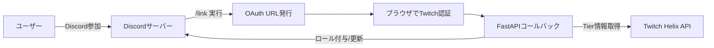

# Twitchサブスク連携Discord Bot - NeiBot

  
  
  

Twitch サブスク状況を自動判定し、Discord ロールの付与 / 剥奪を行う Bot です。  
OAuth2 により Twitch アカウントと Discord アカウントをリンクし、Tier に応じてロールを割り当てます。  

---

## 主な機能

- **Twitch連携**
  - Twitch OAuth2 によるアカウントリンク  
  - Helix API を利用したサブスク Tier 情報の取得  

- **Discord連携**
  - サブスク Tier に応じたロール付与 / 剥奪  
  - サーバー参加時の DM によるリンク催促  
  - 月初に「再リンク催促」フラグを立て、未更新ユーザーに通知  

- **Web管理 (FastAPI)**
  - OAuth コールバック処理  
  - リンク状態確認用のエンドポイント  

- **運用環境**
  - Windows Server 上で常時稼働  
  - Nginx によるリバースプロキシ  
  - Let’s Encrypt (win-acme) による SSL 化  

---

## 技術スタック

- **言語:** Python 3.12  
- **主要ライブラリ:**  
  - [py-cord 2.6.1](https://github.com/Pycord-Development/pycord)  
  - [twitchAPI 4.5.0](https://github.com/Teekeks/pyTwitchAPI)  
  - [FastAPI](https://fastapi.tiangolo.com/)  
- **利用 API:** Twitch Helix API, Discord API  
- **インフラ:** Windows Server, Nginx, win-acme  

---

## 処理フロー



---

## セットアップ（開発環境）

1. **リポジトリ取得**
   ```bash
   git clone https://github.com/NAKANORyunosuke/NeiBot.git
   cd NeiBot
   ```

2. **仮想環境作成**
   ```bash
   python -m venv venv
   venv\Scripts\activate
   ```

3. **依存パッケージのインストール**
   ```bash
   pip install -r requirements.txt
   ```

4. **認証情報の設定**  
   `venv/token.json` を作成:
   ```json
   {
     "discord_token": "YOUR_DISCORD_BOT_TOKEN",
     "twitch_id": "YOUR_TWITCH_USER_ID",
     "twitch_client_id": "YOUR_TWITCH_CLIENT_ID",
     "twitch_seqret_key": "YOUR_TWITCH_SECRET_KEY",
     "twitch_access_token": "YOUR_TWITCH_ACCESS_TOKEN",
     "guild_id": 123456789012345678,
     "twitch_redirect_uri": "http://localhost:8000/twitch_callback",
     "eventsub_secret": "YOUR_EVENTSUB_SECRET"
   }
   ```

5. **Bot 起動**
   ```bash
   python -m bot.bot_client
   ```

   **FastAPI サーバー起動例:**
   ```bash
   uvicorn bot.fastapi_server:app --host 0.0.0.0 --port 8000
   ```

---

## 本番環境構築例（Windows Server）

1. **Python インストール**
   ```powershell
   winget install Python.Python.3.12
   ```

2. **Nginx インストール**
   ```powershell
   choco install nginx
   ```

   設定例:
   ```nginx
   server {
       listen 80;
       server_name your.domain.com;

       location / {
           proxy_pass http://127.0.0.1:8000;
           proxy_set_header Host $host;
           proxy_set_header X-Real-IP $remote_addr;
       }
   }
   ```

3. **SSL 設定 (win-acme)**
   - 証明書を取得し、Nginx に適用
   ```nginx
   server {
       listen 443 ssl;
       server_name your.domain.com;

       ssl_certificate     "C:/ProgramData/win-acme/acme.pem";
       ssl_certificate_key "C:/ProgramData/win-acme/acme-key.pem";

       location / {
           proxy_pass http://127.0.0.1:8000;
           proxy_set_header Host $host;
           proxy_set_header X-Real-IP $remote_addr;
       }
   }
   ```

4. **常時稼働（タスクスケジューラ例）**
   ```powershell
   cd C:\path\to\NeiBot
   venv\Scripts\activate
   python -m bot.bot_client
   ```

---

## ディレクトリ構成

```
NeiBot/
├─ bot/
│   ├─ bot_client.py         # Discord Bot エントリポイント
│   ├─ monthly_relink_bot.py # 月初の再リンク処理
│   └─ utils/                # 共通処理 (Twitch, streak 等)
├─ venv/
│   ├─ token.json            # 認証情報 (非公開)
│   └─ linked_users.json     # Discord↔Twitch リンクデータ
└─ requirements.txt
```

---

## linked_users.json の形式

```json
{
  "123456789012345678": {
    "twitch_username": "user_name",
    "tier": "3000",
    "is_subscriber": true,
    "streak_months": 0,
    "cumulative_months": 0,
    "bits_score": 0,
    "bits_rank": null,
    "linked_date": null,
    "twitch_user_id": "id",
    "resolved": true,
    "first_notice_at": "2025-08-06,
    "last_verified_at": "2025-08-17",
    "dm_failed": false
  }
}
```

---

## 今後の拡張予定

- サブスク期限切れの自動検知
- Bits ランキングによる追加特典ロール
- Django ベースの管理画面で一斉 DM 配布機能

---

## ライセンス

Apache License 2.0